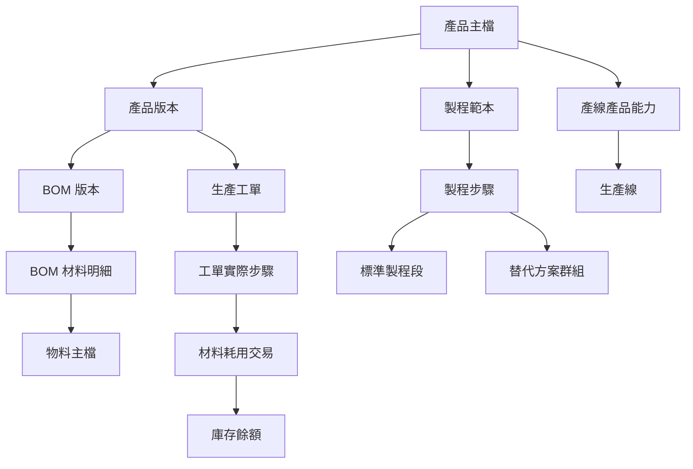
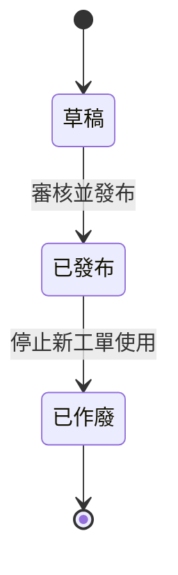
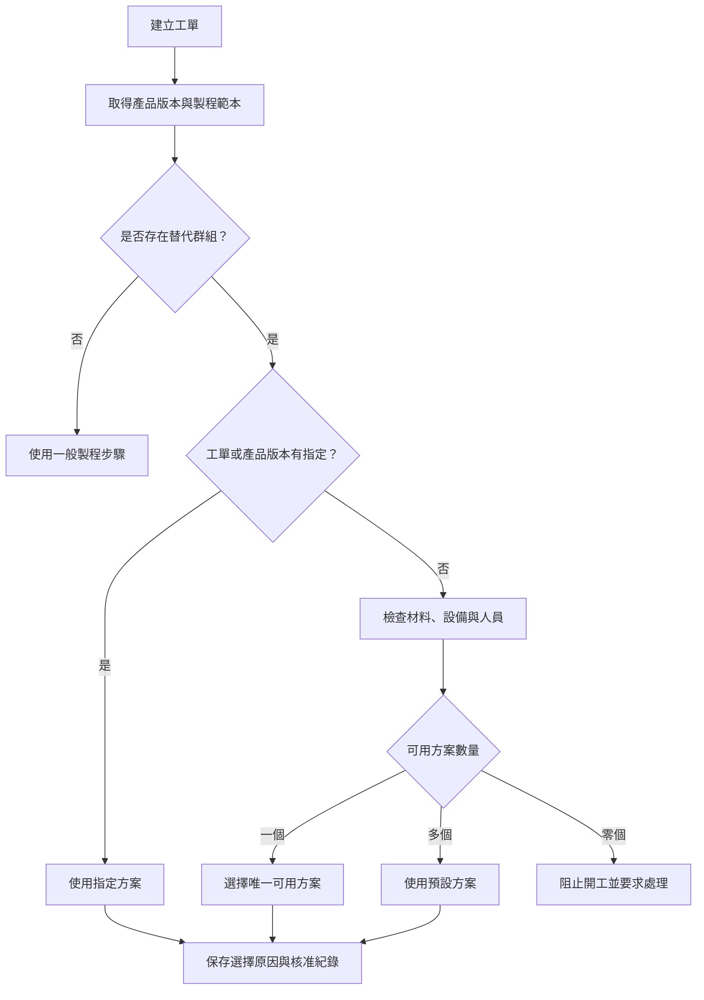
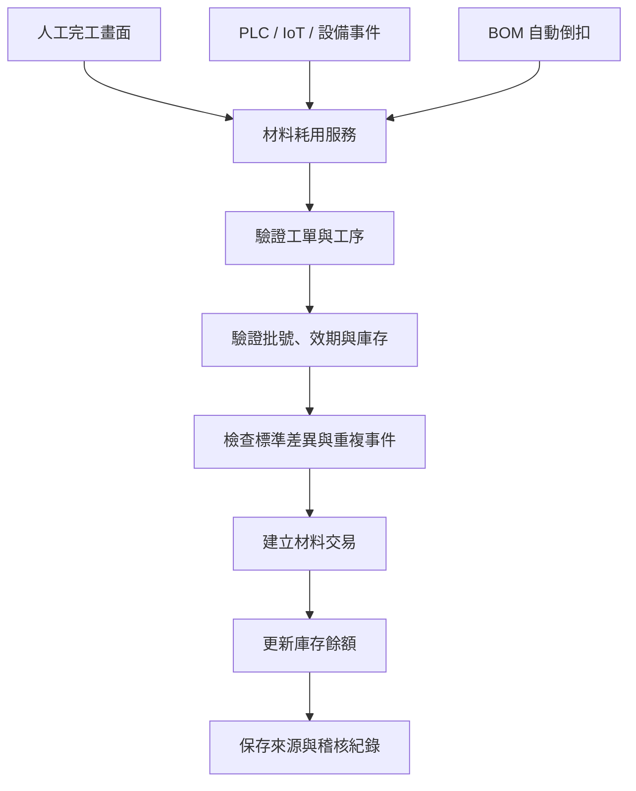

# 從產品版本到自動扣料

> 分類：鞋業 MES  
> Tags：鞋業, MES  
> 建立日期：2026-08-24

---
title: 從產品版本到自動扣料：鞋業 MES 基本資料設計學習筆記
date: 2026-08-24
description: 以鞋業生產情境整理產品、製程、產線能力、BOM、人工報工與設備自動扣料之間的關係。
tags:
  - MES
  - 智慧製造
  - 鞋業
  - BOM
  - 庫存管理
  - 製程管理
  - IIoT
---

# 從產品版本到自動扣料：鞋業 MES 基本資料設計學習筆記

在設計製造執行系統（MES）時，很容易先想到工單、報工、機台連線和生產看板。然而，這些功能能否正確運作，往往取決於前面的基本資料是否定義清楚。

例如：

- 「產品」和「產品版本」有什麼不同？
- 為什麼要設定產線可以生產哪些產品？
- 替代製程應該在什麼時候選擇？
- BOM 是不是在完工時直接拿來扣庫存？
- 人工作業與自動設備的扣料方式能否共用同一套邏輯？

本文以鞋廠的生產情境，整理這些概念之間的關係。

> 本文範例中的產品代碼、鞋款、工廠及數量均為學習用途的虛構資料。

## 一、先看整體關係



可以先用一句話理解每個概念：

| 功能 | 回答的問題 |
|---|---|
| 產品主檔 | 我們要生產哪一款產品？ |
| 產品版本 | 這張工單要依哪一版規格製造？ |
| 製程範本 | 這款產品要按照什麼路線生產？ |
| 製程步驟 | 每一道工序的順序、工時與執行規則是什麼？ |
| 替代群組 | 多個可替換方法中，這次要使用哪一個？ |
| 產線產品能力 | 哪些產線具有生產這款產品的資格？ |
| BOM | 理論上需要哪些材料及多少用量？ |
| 材料交易 | 實際發料、使用、退料和報廢多少？ |
| 庫存餘額 | 根據所有交易計算後，目前還剩多少？ |

## 二、產品主檔：產品的基本身分

產品主檔代表一個可以被生產、排程及版本管理的產品或鞋款。

例如：

```text
產品代碼：RUN-SHOE-A
產品名稱：疾風緩震跑鞋 RS-410
基本單位：雙
```

它通常保存：

- 產品代碼
- 產品名稱
- 基本計量單位
- 產品分類
- 描述
- 啟用狀態

產品主檔是製程、版本、BOM 和產線能力的共同根節點。但它不應保存會隨工程變更而改變的所有規格，否則直接修改產品就可能覆蓋歷史。

## 三、產品版本：保護歷史生產規格

同一款鞋在產品生命週期中，可能因為材料、結構、客戶要求或製程改善而產生多個版本。

```text
RS-410
├─ A 版：初始量產規格
├─ B 版：更換鞋面網布
└─ C 版：調整鞋底黏著條件
```

如果每次工程變更都直接修改原資料，幾個月前的工單重新查詢時，也會看起來像是使用現在的新材料和新製程，導致歷史失真。

因此產品版本通常需要保存：

- 版本代碼
- 生命週期狀態
- 生效與失效日期
- 採用的製程版本
- 採用的 BOM 版本
- 品質檢驗要求
- 工程變更原因
- 外部文件或工程變更單編號
- 發布人與發布時間

典型生命週期如下：



發布日期和生效日期是不同概念。例如 B 版可以在 8 月 20 日核准，但設定 9 月 1 日才生效。

建立工單時，系統應根據工單日期找到有效且已發布的版本，並保存產品、製程和 BOM 的版本快照。未來即使發布 C 版，舊工單仍然使用原本的 B 版。

## 四、製程段、製程範本與製程步驟

這三個名詞容易混淆，可以分成三個責任理解。

### 標準製程段

標準製程段是企業可重複使用的標準作業，例如：

- 裁斷
- 針車
- 成型
- 鞋底貼合
- 外觀檢驗
- 包裝

它可以保存標準工時、標準人數、工作站類型、SOP 和製程參數。

### 製程範本

製程範本代表某個產品的一版完整製程路線表頭，例如「RS-410 標準製程 V2」。

### 製程步驟

製程步驟是範本內真正的執行順序：

```text
10 裁斷
20 針車
30 成型
40 鞋底貼合
50 外觀檢驗
60 包裝
```

每個步驟可以引用標準製程段，也可以針對特定產品覆蓋工時、人數或作業說明。

## 五、有效工時與有效人數

### 有效工時

有效工時是這個產品步驟最後真正採用的標準工時。

```text
步驟有設定專用工時
→ 使用步驟工時

步驟未設定
→ 沿用標準製程段工時
```

例如企業標準針車工時為 40 分鐘，但某款鞋的鞋面結構較複雜，可以在產品步驟覆蓋為 55 分鐘。

有效工時可供：

- 生產排程
- 產能計算
- 完工時間預估
- 標準與實際工時比較
- 瓶頸分析

### 有效人數

有效人數代表執行該步驟時，標準上需要同時安排多少人。

```text
步驟有設定人數
→ 使用步驟人數

步驟未設定
→ 沿用標準製程段人數
```

它不是候補人員，也不是現場目前出勤人數，而是標準人力需求。

## 六、製程執行控制欄位

### 完成後需要人工確認

關鍵製程完成後，不能只有機台或系統自動回報，必須由指定人員確認才能進入下一步。

適合使用於：

- 首件確認
- 品質檢驗
- 換料、換模或換楦
- 關鍵設備參數確認
- 客戶要求的特殊工序

未來交易資料應保存確認人、時間、結果及備註。

### 可略過步驟

表示該步驟不是每張工單都必須執行。例如額外烘乾可能只有在特定材料或濕度條件下才需要。

略過時仍應保存原因、操作人與核准紀錄，不能讓步驟在歷史中無聲消失。

### 替代群組與預設方案

替代群組表示多個步驟具有相同目的，生產時只能選擇其中一個。

例如：

```text
鞋面表面處理
├─ 水性塗層（預設）
└─ 油性塗層（替代）
```

如果沒有替代群組，系統可能以為兩個步驟都必須執行。

替代群組與可略過步驟的差別：

| 設定 | 執行規則 |
|---|---|
| 替代群組 | 多個方案中選一個 |
| 可略過步驟 | 可以完全不執行 |
| 預設方案 | 沒有指定時選擇此方案 |
| 人工確認 | 完成後需要指定人員簽認 |

## 七、實際生產時如何選擇替代方案？

替代方案應在工單建立或開工前決定，不能讓現場作業員看到多個步驟後自行猜測。

建議優先順序：

1. 工單明確指定。
2. 產品版本或客戶規格指定。
3. 根據材料、設備與人員資格判斷。
4. 沒有其他指定時使用預設方案。



工單發布時，應展開成一份自己的實際製程步驟快照，未選中的替代步驟不應出現在現場待作業清單。

## 八、產線產品能力：生產資格而非即時狀態

產線產品能力定義哪一條產線被允許生產哪一種產品。

需要這項設定，是因為產線可能有不同的：

- 設備及工作站
- 模具和鞋楦
- 人員技能
- 尺寸範圍
- 客戶或品質認證
- 可處理材料
- 標準產能

產品與產線通常是多對多關係：一條線可生產多款產品，一款產品也可以由多條線生產。

排產前如果找不到產品和產線的能力關係，系統應阻止排程。

但要特別注意：

> 產線產品能力只代表「原則上有資格」，不代表「現在一定可以生產」。

即時生產還要檢查：

- 當班人力是否足夠
- 設備是否故障
- 材料是否充足
- 產能是否被其他工單占用
- 產品、製程及 BOM 版本是否有效

它很像駕照：有駕照表示具備資格，不代表現在一定有車、有時間或道路暢通。

## 九、BOM 不等於庫存

BOM 保存的是每單位產品的標準材料用量，不是目前庫存，也不是某張工單的實際耗用。

| 資料 | 負責內容 |
|---|---|
| BOM 明細 | 每雙鞋理論上使用多少材料 |
| 工單材料需求 | 該工單預計需要多少 |
| 庫存預留 | 哪些庫存已保留給工單 |
| 發料與移轉 | 材料從原料倉移到線邊倉 |
| 材料耗用 | 實際投入生產多少 |
| 退料與報廢 | 剩餘可退多少、損失多少 |
| 庫存餘額 | 根據交易累計後剩多少 |

例如：

```text
鞋面網布標準用量：0.4200 m²／雙
工單數量：100 雙
製程損耗率：5%

建議發料量：
0.4200 × 100 ×（1 + 5%）= 44.1000 m²
```

這個結果是建議準備或發料量，不應回頭修改 BOM。

## 十、庫存應該在什麼時候更新？

實務上通常分成三個階段。

### 1. 工單排程時：預留

預留會降低可用庫存，但實體材料仍在原庫位。

```text
實體庫存：1,000 m²
工單預留：44.1 m²
可用庫存：955.9 m²
```

### 2. 倉庫發料時：庫位移轉

```text
原料倉：-44.1 m²
線邊倉：+44.1 m²
工廠總庫存：不變
```

### 3. 製程完工時：實際耗用

材料真正投入生產後，才建立耗用交易並扣除線邊庫存。剩餘材料則退料或記錄報廢。

## 十一、不要讓作業員每次輸入「剩餘庫存」

一般製程完工時，不應要求作業員輸入倉庫還剩多少，而是輸入這次發生的交易：

- 實際使用量
- 退料量
- 報廢量
- 材料批號

系統再自行計算：

```text
剩餘庫存
= 期初庫存
+ 收料
+ 退料
- 發料
- 實際耗用
- 報廢
± 盤點調整
```

只有定期盤點、工單清線、帳實不符或化學品重新秤重時，才輸入現場實際剩餘量並產生盤點調整。

## 十二、不同物料適合不同扣料方法

| 材料 | 建議扣料方式 | 建議時間點 |
|---|---|---|
| 鞋面網布、皮料 | 實際領料、餘料與邊料 | 裁斷完成 |
| 中底、大底、鞋墊 | 依完成與報廢件數 | 對應貼合完成 |
| 鞋帶 | 標準量帶入，由人員確認或倒扣 | 穿鞋帶完成 |
| 標籤、鞋盒 | 按完成數自動倒扣 | 包裝完成 |
| 膠水、處理劑 | 流量計、秤重或容器量 | 上膠完成 |
| 車縫線 | 標準倒扣加定期盤點 | 針車完成 |
| 外箱 | 依實際裝箱數 | 裝箱完成 |

這表示 BOM 明細除了標準用量，最好還能設定：

- 投料製程
- 扣料模式
- 是否要求批號
- 允許耗用差異

## 十三、人工作業如何扣料？

人工作業適合在完工報工時，由系統先帶出標準量，再讓使用者確認或修正。

```text
工單：WO-20260824-001
製程：鞋底貼合
投入數量：100
良品數量：97
不良數量：3

系統建議：
大底 100 雙
膠水 3.200 kg

使用者確認：
大底實際耗用 100 雙
膠水實際耗用 3.260 kg
```

系統應同時更新：

- 工單進度
- WIP 數量
- 材料耗用
- 線邊庫存
- 批號追溯
- 標準與實際差異
- 操作人與時間

## 十四、機器作業如何自動扣料？

固定且可量測的機器作業，可以透過 PLC、IoT Gateway、OPC UA 或其他介面回傳產量與材料用量。

```json
{
  "machine_id": "GLUE-01",
  "work_order": "WO-20260824-001",
  "operation": "CEMENTING",
  "good_qty": 98,
  "ng_qty": 2,
  "material_lot": "ADH-260824-A",
  "actual_consumption_kg": 3.26,
  "external_event_id": "GLUE-01-20260824-000123"
}
```

MES 收到事件後應依序：

1. 驗證工單與工序。
2. 確認設備綁定正確工作站。
3. 驗證材料批號、效期與庫位。
4. 檢查可用庫存。
5. 檢查耗用量是否異常。
6. 建立生產報工。
7. 建立材料耗用交易。
8. 更新庫存餘額。
9. 保存設備來源與稽核紀錄。

如果設備只能回傳產量，MES 可以按 BOM 倒扣。按件的大底、鞋帶或鞋盒通常適合；膠水等有揮發與殘留的材料，最好使用實際量測。

## 十五、人工與機器應共用同一個耗用服務

人工與機器的差別只是資料來源，庫存規則不應各寫一套。



建議扣料來源：

| 來源 | 說明 |
|---|---|
| `manual` | 人工輸入實際耗用 |
| `confirm_standard` | 系統帶出標準量，由人員確認 |
| `backflush` | 完工時按 BOM 自動倒扣 |
| `machine_actual` | 使用設備回傳的實際耗用 |
| `weighing` | 依電子秤前後重量計算 |
| `adjustment` | 盤點或授權調整 |

## 十六、防止重複扣料與異常耗用

設備可能因為網路中斷而重送同一筆事件。如果 MES 每收到一次就扣一次庫存，結果會非常嚴重。

每筆外部事件都應有唯一識別碼：

```text
external_event_id
```

資料庫可建立類似限制：

```sql
UNIQUE(machine_id, external_event_id)
```

相同事件重送時，系統只能回覆已處理，不得再次扣料。人工報工同樣需要唯一交易編號，防止重複按下完成按鈕。

自動扣料也不能完全相信輸入，至少應檢查：

- 數量不可為負數
- 實際耗用不可異常超過標準
- 批號必須存在且未過期
- 批號必須位於正確庫位
- 可用庫存必須足夠
- 設備與工作站必須相符
- 工單與工序必須處於可報工狀態
- 同一事件不可重複入帳

例如標準膠水耗用為 3.2 kg，設備卻回傳 32 kg，系統不應直接扣庫存，而應建立異常並等待主管確認。

## 十七、建議的核心資料表

如果要把基本資料延伸到實際生產與庫存，至少需要以下交易資料：

```text
work_orders                    生產工單
work_order_steps              工單實際製程快照
work_order_variant_selections 工單替代方案選擇
work_order_materials          工單材料需求與實績
inventory_lots                材料批號
inventory_balances            各庫位庫存餘額
material_reservations         工單庫存預留
material_transactions         收料、發料、耗用、退料與報廢
machine_events                設備原始事件與防重複識別
production_confirmations      人工與設備報工紀錄
```

其中 `material_transactions` 應作為庫存帳務依據，`inventory_balances` 可以是交易累計後的快速查詢結果，但不能成為沒有交易來源的任意數字。

## 十八、總結

這次整理後，我對 MES 基本資料和扣料流程的理解可以濃縮成以下幾句：

1. 產品主檔定義產品身分，產品版本保護不同時間的正式規格。
2. 製程範本定義產品路線，製程步驟保存工時、人數與執行規則。
3. 替代群組是多選一；可略過步驟則是可以完全不做。
4. 產線產品能力是生產資格，不是即時產能或設備狀態。
5. BOM 保存理論標準，不直接代表實際庫存。
6. 完工時應輸入或接收「實際耗用」，不應每次重填剩餘庫存。
7. 人工、倒扣和機器回傳應共用同一套材料耗用服務。
8. 所有庫存變化都應有正式交易、唯一編號與稽核來源。

最重要的設計原則是：

> BOM 告訴系統理論上應該用多少；人工或設備回報實際用了多少；材料交易負責入帳；庫存餘額則由交易計算得到。

當產品版本、製程、產線能力、BOM 和庫存交易的責任被清楚分開後，MES 才能同時支援排程、執行、品質、成本與追溯，而不只是做出一個可以輸入數字的畫面。
